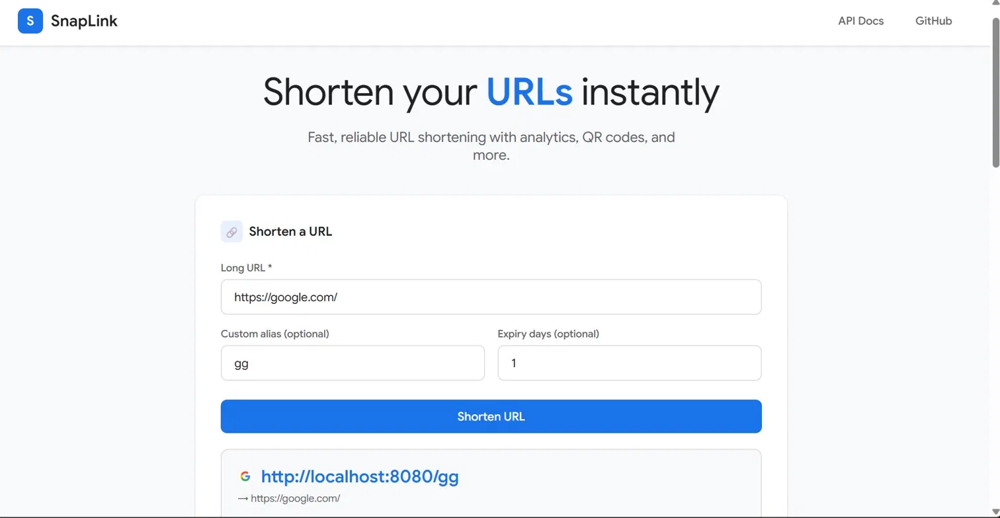
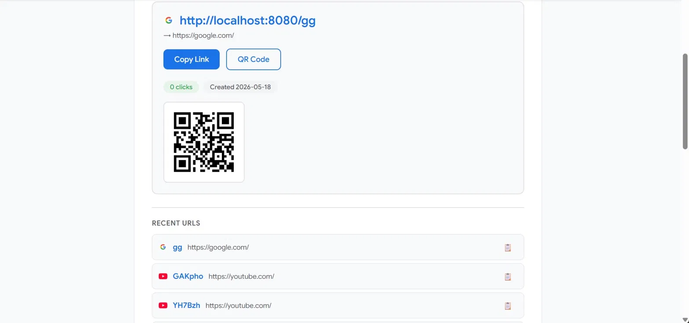
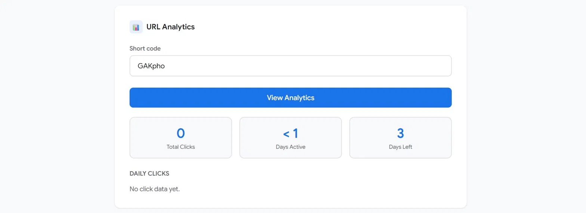
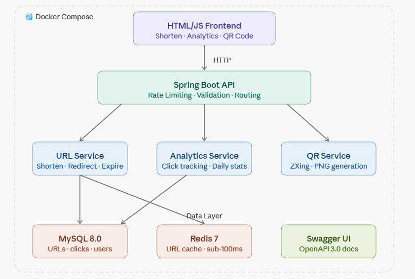

# SnapLink — Production-Grade URL Shortener

A full-stack URL shortening service built with Java, Spring Boot, MySQL, and Redis. Designed to demonstrate production-grade backend engineering patterns commonly discussed in FAANG system design interviews.

---

## 🚀 Live Demo

> ## 🚀 Live Demo

> 🔗 [snaplink-production-adc9.up.railway.app](https://snaplink-production-adc9.up.railway.app)  
> 📖 [API Documentation](https://snaplink-production-adc9.up.railway.app/swagger-ui.html)
> 

---

## ✨ Features

| Feature | Description |
|--------|-------------|
| 🔗 URL Shortening | Generate short codes with optional custom aliases |
| ⏰ URL Expiry | Set expiry dates — expired URLs return 410 Gone |
| 📊 Analytics Dashboard | Track daily click counts per short URL |
| 🔒 Rate Limiting | Token Bucket algorithm — 10 requests/minute per IP |
| ⚡ Redis Caching | Sub-100ms redirect response times |
| 📱 QR Code Generation | Auto-generate QR codes for every short URL |
| 📖 Swagger Docs | Full OpenAPI 3.0 documentation at `/swagger-ui.html` |
| 🐳 Docker | One-command deployment with Docker Compose |

---
## 📸 Screenshots

### URL Shortener


### QR Code & Recent URLs


### Analytics Dashboard

## 🏗️ System Architecture


---

## 🛠️ Tech Stack

**Backend**
- Java 21
- Spring Boot 3.5
- Spring Data JPA / Hibernate
- Spring Data Redis (Lettuce)
- Bucket4j (Rate Limiting)
- Google ZXing (QR Code)
- SpringDoc OpenAPI (Swagger)

**Database & Cache**
- MySQL 8.0
- Redis 7

**DevOps**
- Docker & Docker Compose
- Maven

**Testing**
- JUnit 5
- Mockito
- Spring MockMvc

---

## 📡 API Endpoints

| Method | Endpoint | Description |
|--------|----------|-------------|
| `POST` | `/api/shorten` | Shorten a URL |
| `GET` | `/{shortCode}` | Redirect to original URL |
| `GET` | `/api/stats/{shortCode}` | Get click stats |
| `GET` | `/api/analytics/{shortCode}` | Get daily click analytics |
| `GET` | `/api/qr/{shortCode}` | Get QR code image |
| `GET` | `/swagger-ui.html` | API documentation |

### Example Request

```bash
curl -X POST http://localhost:8080/api/shorten \
  -H "Content-Type: application/json" \
  -d '{
    "url": "https://www.google.com",
    "customAlias": "goog",
    "expiryDays": 30
  }'
```

### Example Response

```json
{
  "shortUrl": "http://localhost:8080/goog",
  "shortCode": "goog",
  "originalUrl": "https://www.google.com",
  "clickCount": 0,
  "createdAt": "2026-05-18T10:00:00",
  "expiresAt": "2026-06-17T10:00:00"
}
```

---

## ⚡ Getting Started

### Prerequisites
- Docker Desktop
- Java 21
- Maven

### Run with Docker (Recommended)

```bash
# Clone the repository
git clone https://github.com/pragya0151/snaplink.git
cd snaplink

# Start all services (App + MySQL + Redis)
docker-compose up --build
```

App will be available at `http://localhost:8080`

### Run Locally (without Docker)

```bash
# Start MySQL and Redis locally first, then:
./mvnw spring-boot:run
```

---

## 🧪 Running Tests

```bash
./mvnw test
```

**Test Coverage:**
- 8 Unit tests (Service layer — Mockito)
- 9 Integration tests (Controller layer — MockMvc)
- Total: 17 tests, all passing ✅

---

## 🔑 Key Design Decisions

**Why Redis for caching?**  
The redirect endpoint (`GET /{shortCode}`) is the most frequently called endpoint. Caching the URL mapping in Redis avoids a database hit on every redirect, achieving sub-100ms response times.

**Why Token Bucket for rate limiting?**  
Token Bucket allows short bursts of requests while enforcing a sustained rate limit. This is the same algorithm used by AWS API Gateway and Stripe. Implemented using Bucket4j — 10 requests/minute per IP.

**Why lazy expiry check?**  
Instead of running a scheduled cleanup job, expiry is checked on access. This is simpler, avoids race conditions, and is how Redis TTL itself works. Expired URLs return `410 Gone`.

**Why Docker Compose?**  
Eliminates "works on my machine" problems. The entire stack (app + MySQL + Redis) starts with a single `docker-compose up` command, making local development and deployment consistent.

---

## 📁 Project Structure

```
src/
├── main/
│   ├── java/com/Pragya/urlshortener/
│   │   ├── config/          # Redis, Rate Limiting, Swagger config
│   │   ├── controller/      # REST Controllers + Global Exception Handler
│   │   ├── dto/             # Request/Response DTOs
│   │   ├── model/           # JPA Entities (Url, UrlClick)
│   │   ├── repository/      # Spring Data JPA Repositories
│   │   └── service/         # Business Logic (UrlService, AnalyticsService)
│   └── resources/
│       ├── application.properties
│       └── static/index.html    # Frontend UI
└── test/
    └── java/com/Pragya/urlshortener/
        ├── UrlControllerIntegrationTest.java
        ├── UrlshortenerApplicationTests.java
        └── service/UrlServiceTest.java
```

---

## 🌱 Future Improvements

- [ ] AWS EC2 deployment with RDS and ElastiCache
- [ ] JWT-based user authentication
- [ ] Custom domain support
- [ ] Click analytics by country and browser
- [ ] React frontend rewrite
- [ ] Testcontainers for true integration tests

---

## 👩‍💻 About

Built by **Pragya** — Final year student | Full-Stack & Backend Developer

This project was built to demonstrate:
- Production-grade backend patterns (caching, rate limiting, containerization)
- System design thinking (scalability, TTL, distributed caching)
- Full-stack development (REST API + frontend UI)
- Software engineering best practices (testing, documentation, Docker)

[](https://github.com/pragya0151)
[](https://linkedin.com)
